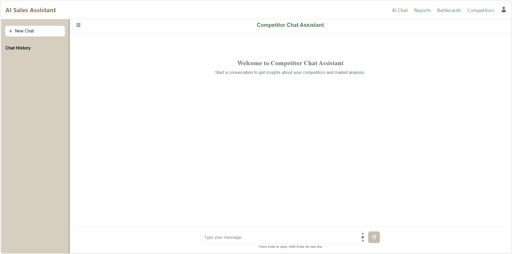

# AI Sales Assistant

An AI-powered SaaS application developed as part of my **AI Software Engineering Internship at NTG Clarity**.  
The project focuses on monitoring competitor data, analyzing it using AI, and generating actionable insights through reports, battlecards, and a conversational assistant.

---

## Project Overview

The **AI Sales Assistant** helps businesses track competitors, understand market signals, and generate AI-driven insights from public internet sources.

The system simulates a real-world SaaS product and follows modern software engineering practices, including:
- Full-stack development
- Retrieval-Augmented Generation (RAG)
- Workflow orchestration using LangGraph
- Agile teamwork and iterative delivery

---

## System Architecture

The project is composed of the following main components:

### Frontend
- **Next.js** application for user interaction and visualization
- Authentication & user profiles
- Dashboard for reports, battlecards, and chatbot
- Scheduling and account settings

### Backend
- **FastAPI** for API endpoints and orchestration
- MVC architecture with a dedicated service layer
- LangGraph workflows for AI reasoning
- APScheduler for automated reports

### Databases
- **PostgreSQL (Supabase-hosted)**  
  Stores users, competitors, reports, and metadata
- **Milvus (Zilliz)**  
  Vector database for semantic search and RAG pipelines

### External Services
- **Crawl4AI** for scraping competitor websites
- **Tavily Search** (integrated inside LangGraph) for live web context
- **LLM APIs** for AI generation and reasoning

---

## 🧩 Core Features

### Chatbot (Conversational AI)

An interactive chatbot that allows users to query competitor data using natural language.

- Persistent conversations powered by LangGraph
- Tavily web search for up-to-date context
- Context-aware and structured AI responses

_Chatbot interface_  

---

### Reports (Automated & On-Demand)

AI-generated reports that summarize and analyze competitor data.

- Scheduled reports using APScheduler
- On-demand report generation
- Reports include:
  - Competitor updates
  - Key insights extracted from scraped data
- Reports are stored in PostgreSQL and visualized in the dashboard

---

### Battlecards (On-Demand Competitor Insights)

Battlecards provide focused AI insights about a **single selected competitor**.

- User selects a competitor from their list
- Optional custom query to focus analysis  
  (e.g. pricing, product features, risks)
- Generates structured, actionable insights
- Users can add notes to each battlecard

_Battlecard view_  

---

## Data Pipeline

1. Competitor websites are scraped using Crawl4AI
2. Extracted text is cleaned and processed
3. Text embeddings are generated using sentence-transformers
4. Embeddings are stored in Milvus (partitioned per user)
5. LangGraph workflows perform retrieval, reasoning, and generation
6. Results are delivered to the frontend via FastAPI APIs

---

## 🐳 Docker & Development Environment

The project uses **Docker and Docker Compose** to ensure:
- Environment consistency across the team
- Easy service orchestration
- Smooth onboarding for new contributors

All services can be started locally using Docker Compose.

---

## Deployment

- **Frontend:** Deployed on **Vercel**
- **Backend:** Deployed on **Hugging Face Spaces**
- Databases are connected remotely

🔗 **Live Application:**  
[(AI Sales Assistant)](https://ai-sales-assistant-seven.vercel.app/)

---

## Technologies Used

- **Frontend:** React, Next.js  
- **Backend:** Python, FastAPI  
- **AI & NLP:** LangGraph, LLM APIs, Sentence Transformers  
- **Databases:** PostgreSQL (Supabase), Milvus (Zilliz)  
- **Web Scraping:** Crawl4AI  
- **Search:** Tavily (LangGraph tool)  
- **DevOps:** Docker, Docker Compose  
- **Project Management:** Agile methodology, Wekan boards  

---

## Lessons Learned

- Built a real-world full-stack AI SaaS application
- Designed and implemented RAG pipelines with LangGraph and Milvus
- Integrated web scraping, vector search, and AI reasoning
- Worked in an agile team environment with task tracking and code reviews
- Improved system design, collaboration, and technical communication skills

---

## 👥 Team & Acknowledgment

This project was developed collaboratively during my internship at **NTG Clarity** as part of an intern team following agile practices.

---

## 👤 Author

**Ahmed Mohamed**  
📧 [ahmed.mohamed04@hotmail.com](mailto:ahmed.mohamed04@hotmail.com)  
🔗 [LinkedIn Profile](https://www.linkedin.com/in/ahmed04/)

